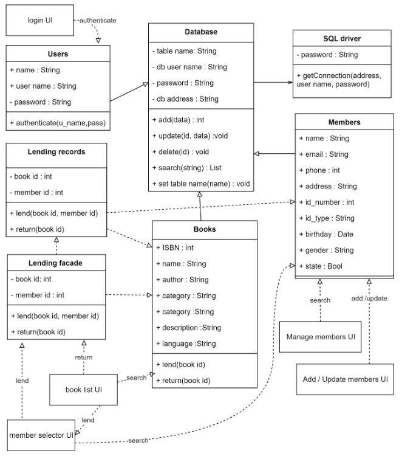

# Library Management System
## Simple Library management system using JAVA.

This is a Simple Library management system developed using the JAVA programing language. The program was developed using the Apache Netbeans IDE. The application uses JDK 17 and MySQL server. This was developed by me for a campus assigmnet. 

## Setup

The `dbSetup.sql` file in the root directory can be used to create the required database. Database connection can be configured in the `DB/Database.java` file.
```PHP
/**
 * Database Configuration variables
 */
 private String dbName = "LibraryDB";
 private String dbUsername = "root";
 private String dbPassword = ""; 
```


## The system has these basic library management functions 
* Register and manage library members
* Register and manage Books
* Lend books, return books and track landed books
* Register system users

## Class Diagram


## Database design Diagram


## UI
### Login


### User Registration


### Main screen


### Book Registration


### Book Lending


### Member registration


### Manage Members


